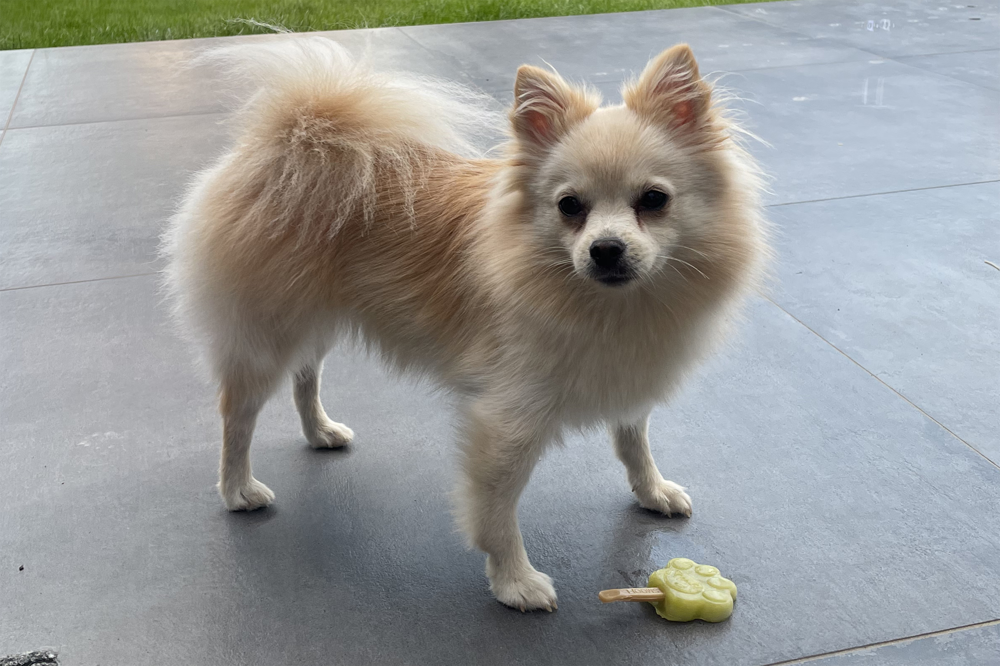

<html lang='en'>
  <head>
    <meta charset='UTF-8'/>
    <title>Thomas Opheide</title>
    <link rel="stylesheet" href="styles.css"/>
  </head>
  <body>
    

      

        

          
Thomas Opheide

          <nav class = "nav">
            <a href = "#" class='about'>Home</a>
            <a href = "#aboutme" class='about'>About</a>
            <a href = "#interests" class='about'>Interests</a>
          </nav>
        

      

        

          <h2 id="aboutme"> About me</h2>
          

              <figure> </img></figure>
              

                
My name is Thomas and I'm 30 years old.  I live together with my fiance Lauren and our little dog Bo, we have a wedding planned in July 2022!

                 
                
Originally I studied to become a carpenter, while working as a carpenter I used to wite automation software to simplify the workflow towards CNC machines.

                 
                
Over the years I got more passionate about programming and that lead me to Switchfully.

              

          

        

        

          <h2 id="interests">My interests</h2>
          

            

              <figure> </img></figure>
              
Bo, our cute little doggo

            

            

              <figure> </img></figure>
              
Java progamming

            

            

              <figure> </img></figure>
              
Open water Diving

            

          

        

      

        

          
&copy; Thomas Opheide

        

      

    

  </body>
</html>
